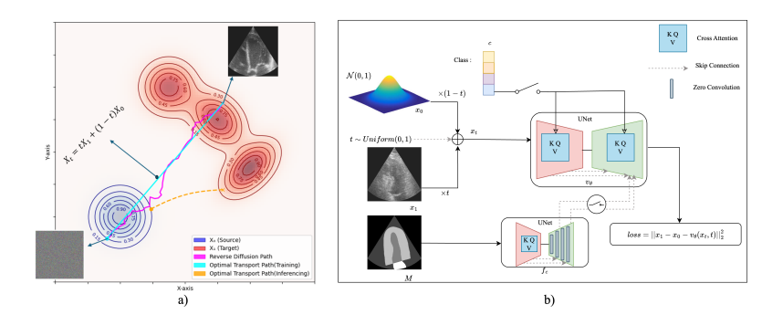

# MOTFM (Medical Optimal Transport Flow Matching)

[](https://arxiv.org/abs/2503.00266)


**MOTFM** (Medical Optimal Transport Flow Matching) accelerates medical image generation while preserving, and often improving, quality, across **2D/3D** and **class/mask-conditional** setups.

### [Paper](https://www.arxiv.org/abs/2503.00266)
### [Model Checkpoint](https://drive.google.com/file/d/1ZS2ApElLkWSKLd4xX2zf7bDHMpaMIjSF/view?usp=sharing)

<br>

<p align="center">
  
</p>

---

## Requirements

To install the required packages, run:
```bash
pip install -r requirements.txt
```

---

## Data Preparation

**Important Note**:  
- Your training data **must** be stored in a single `.pkl` file, which itself must follow the structure below.  

Within that `.pkl` file, your data dictionary should look like:
```python
{
  "train": [  # List of training samples
    {
      "image": "Tensor[Channels, Height, Width, ...] (float32, normalized)",
      "mask":  "Tensor[1, Height, Width, ...] (int32)",
      "class": "Scalar integer (int32)",
      "metadata": "Structured data (dict or other format)"
    },
    ...
  ],

  "valid": [  # List of validation samples
    {
      "image": "Tensor[Channels, Height, Width, ...] (float32, normalized)",
      "mask":  "Tensor[1, Height, Width, ...] (int32)",
      "class": "Scalar integer (int32)",
      "metadata": "Structured data (dict or other format)"
    },
    ...
  ],

  "test": [  # List of test samples
    {
      "image": "Tensor[Channels, Height, Width, ...] (float32, normalized)",
      "mask":  "Tensor[1, Height, Width, ...] (int32)",
      "class": "Scalar integer (int32)",
      "metadata": "Structured data (dict or other format)"
    },
    ...
  ]
}
```

Make sure your dataset adheres to the described data structure, saved in a single `.pkl` file, before running the training or inference pipelines.

---

## Configuration Files

You must **either create** or **modify** a YAML configuration file to suit your dataset paths, model parameters, and hyperparameters. Some sample configuration files are provided in the `configs/` folder. By default, `configs/default.yaml` is used if no custom path is provided.

---

## Training

To train the model, run:
```bash
python trainer.py --config_path configs/default.yaml
```

- `--config_path`: Path to your YAML configuration file. Defaults to `configs/default.yaml` if not provided.

**Note**: Make sure you have prepared your dataset (as a single `.pkl` file) and configuration file properly before starting training.

---

## Inference

Use `inferer.py` to generate synthetic samples from a trained checkpoint and save them as a `.pkl`.

### Quick start

Run with your config and checkpoint directory:
```bash
python inferer.py \
    --config_path configs/default.yaml \
    --model_path mask_class_conditioning_checkpoints/default \
    --num_samples 200 \
    --num_inference_steps 5 \
    --output_norm clip_0_1
```

For the CAMUS 10-epoch example in this repo:
```bash
python inferer.py \
    --config_path configs/mask_class_conditioning_camus_10ep.yaml \
    --model_path mask_class_conditioning_checkpoints/mask_class_conditioning_camus_10ep \
    --num_samples 16 \
    --num_inference_steps 10 \
    --output_norm clip_0_1
```

### Arguments

- **`--config_path`** (`str`, default: `configs/default.yaml`): Config file used for model/data setup.
- **`--model_path`** (`str`, optional): Checkpoint `.ckpt` file or directory.
- **`--num_samples`** (`int`, default: `10`): Number of samples to save.
- **`--num_inference_steps`** (`int`, default: `5`): Number of solver time points used during sampling.
- **`--output_path`** (`str`, optional): Explicit output `.pkl` path.
- **`--overwrite`** (`flag`): Overwrite an existing file at `--output_path`.
- **`--output_norm`** (`str`, default: `clip_0_1`): One of `clip_0_1`, `per_sample_minmax`, `global_minmax`, `none`.
- **`--allow_config_mismatch`** (`flag`): Allow loading a checkpoint whose saved critical model fields differ from current config.

### Checkpoint resolution behavior

If `--model_path` is omitted, inferer searches:
- `train_args.checkpoint_dir/<config_basename>`

If `--model_path` is provided, inferer checks (in order):
- `<model_path>`
- `<model_path>/<config_basename>`
- `<model_path>/latest`

If a directory is selected, checkpoint preference is:
- `last.ckpt` (if present)
- otherwise, the most recently modified `*.ckpt`

### Output behavior

- If `--output_path` is omitted, output is saved in the resolved checkpoint directory as:
  - `samples_<config_basename>_<checkpoint_name>_steps<time_points>.pkl`
- If output file exists and `--overwrite` is not set, a timestamp suffix is appended automatically.
- Generated samples are produced from the validation split and saved under:
  - `data_args.split_train`
  - and also `data_args.split_val` if that key is different.

### CPU-only note

If you run inference on CPU, set `model_args.use_flash_attention: false` in your config.  
Flash attention requires CUDA and will raise an error otherwise.

---


## 💥 News 💥
- **`09.04.2025`** | Code is released!
- **`29.03.2025`** | The paper is now available on Arxiv! 🥳
- **`27.05.2025`** | The paper got accepted to MICCAI 2025! 🎉
---

## Citation

If you find this code or our work useful in your research, please cite:

```BibTeX
@inproceedings{yazdani2025flow,
  title={Flow matching for medical image synthesis: Bridging the gap between speed and quality},
  author={Yazdani, Milad and Medghalchi, Yasamin and Ashrafian, Pooria and Hacihaliloglu, Ilker and Shahriari, Dena},
  booktitle={International Conference on Medical Image Computing and Computer-Assisted Intervention},
  pages={216--226},
  year={2025},
  organization={Springer}
}
```

---

**Enjoy working with MOTFM!** Feel free to open an issue or pull request if you have any questions or suggestions.
